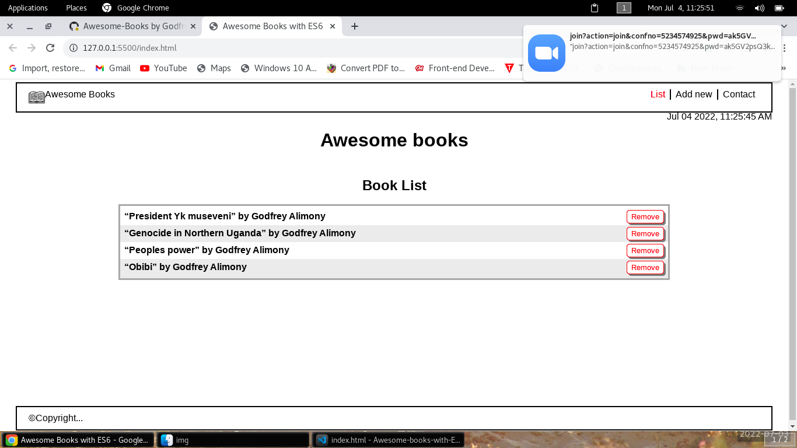
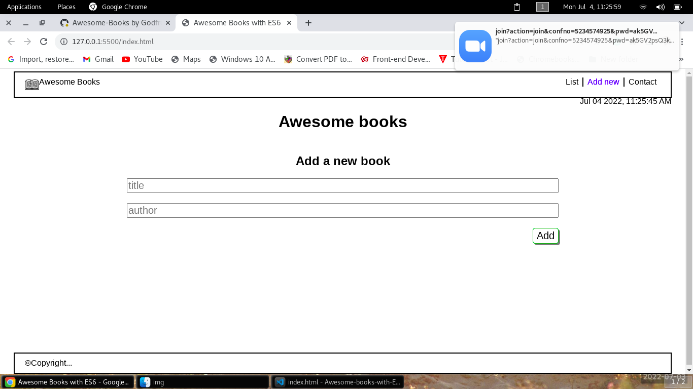
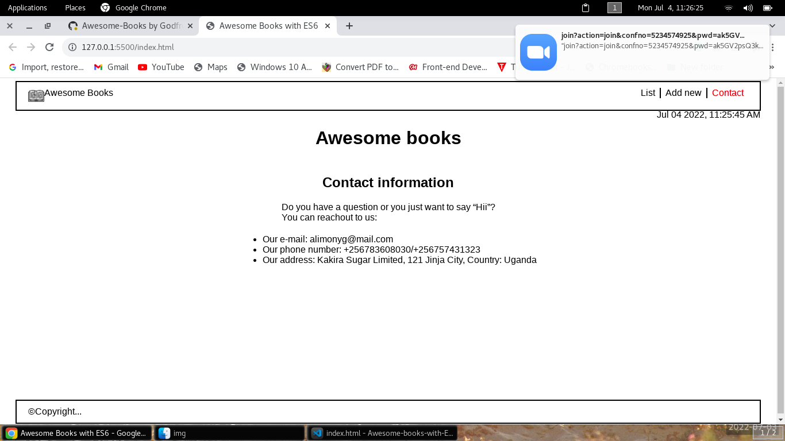
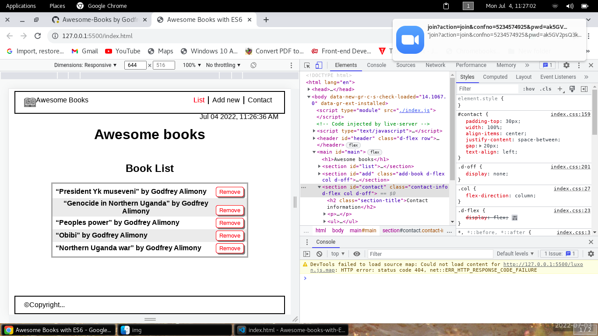

# Awesome-books

In this project, you will restructure your Awesome books app code. The goal is to make it more organized by using modules. You will also practice the ES6 syntax that you have learned.
### Desktop Version

### Mobile Version

In this website you can add books of your choice to the list of books and save them in your browser's localstorage.

## Built With

- HTML, CSS and JavaScript (ES6)

## Live Demo

- [Live Demo Link](https://godfrey-alimony.github.io/Awesome-books-with-ES6/)
- Live Demo Might not work due to 'luxon' module. So, you checkout it out by intalling it locally following the steps in 'Getting Started' section.

## Getting Started

- Install Node.js
- Install text editor of your choice (eg. VS Code)
- Clone the repository from [here](https://github.com/Godfrey-Alimony/Awesome-books-with-ES6.git)
- Change directory to 'cd Awesome-books-with-es6-modules'
- On the root directory, run 'npm install' on the terminal to install packages.
- Open the index.html file in your browser (using live server) to check your updates and navigate to other pages.

## Authors

👤 **Alimony Godfrey **

- GitHub: [@Godfrey-Alimony](https://github.com/Godfrey-Alimony)
- LinkedIn: [@Godfrey-Alimony](https://www.linkedin.com/in/alimony-godfrey-8aba3136)

## 🤝 Contributing

Contributions, issues, and feature requests are welcome!

Feel free to check the [issues page](../../issues/).

## Show your support

Give a ⭐️ if you like this project!

## Acknowledgments

- [Microverse Inc](https://www.microverse.org/)

## 📝 License

This project is [MIT](./MIT.md) licensed.
